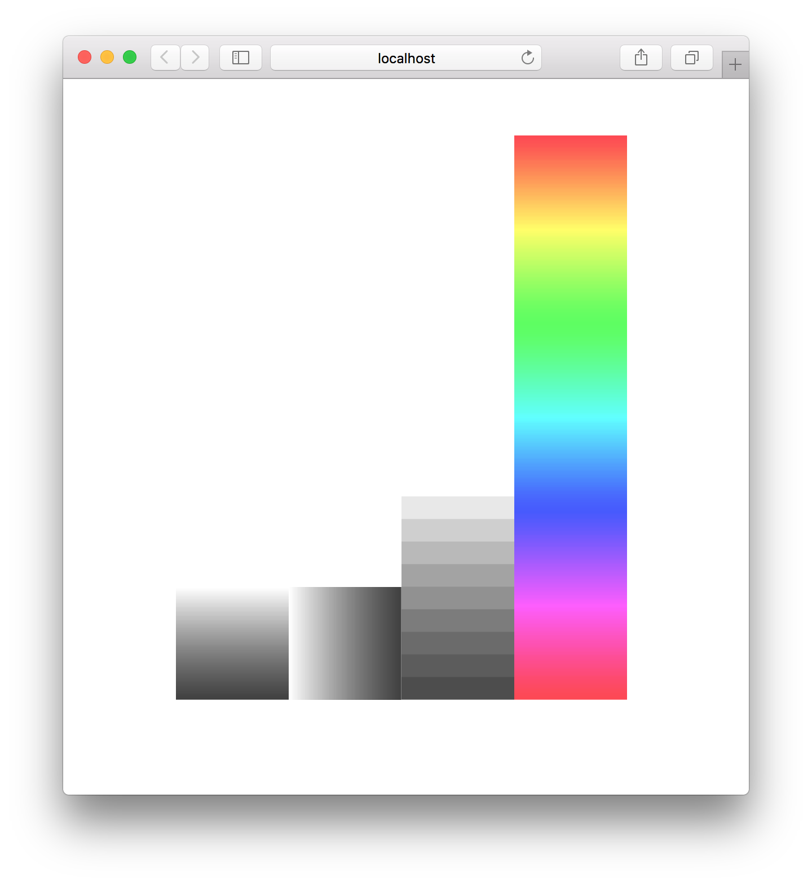

# colorcoded-bar

  A colorcoded bar.

## Example

  

```js
var Bar = require('colorcoded-bar');

// Vertical bar

(function(){
  var bar = new Bar();
  for (var i = 0; i < 100; i++) {
    bar.set(i, 'rgba(1, 1, 1, ' + i / 100 + ')');
  }
  document.body.appendChild(bar.render());
})();

// Horizontal bar

(function(){
  var bar = new Bar();
  for (var i = 0; i < 100; i++) {
    bar.set(i, 'rgba(1, 1, 1, ' + i / 100 + ')');
  }
  document.body.appendChild(bar.render({ horizontal: true }));
})();

// Automatic input scaling

(function(){
  var bar = new Bar();
  for (var i = 0; i < 10; i++) {
    bar.set(i, 'rgba(1, 1, 1, ' + i / 10 + ')');
  }
  document.body.appendChild(bar.render({ height: 200 }));
})();

// Pretty rainbows

(function(){
  var bar = new Bar();
  var height = 500;
  for (var i = 0; i < height; i++) {
    var color = 'hsl(' + Math.round(i / height * 360) + ', 100%, 50%)';
    bar.set(i, color);
  }
  document.body.appendChild(bar.render({ height: height }));
})();
```

  [](http://requirebin.com/?gist=88e975aa96d4481e0956)

## Installation

```bash
$ npm install colorcoded-bar
```

## API

### new Bar()

  Create a new colorcoded bar.

### #set(idx, color)

  Set `color` at `idx`, any css supported color notation will work.

### #render([{ canvas, horizontal, height, width }])

  Render the bar, returning a canvas.

  Options:

- `canvas`: use an already existing canvas
- `horizontal`: render from left to right instead of top to bottom
- `height` / `width`: size the canvas. default: 100

## License

  MIT

